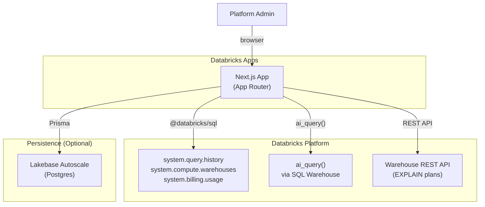
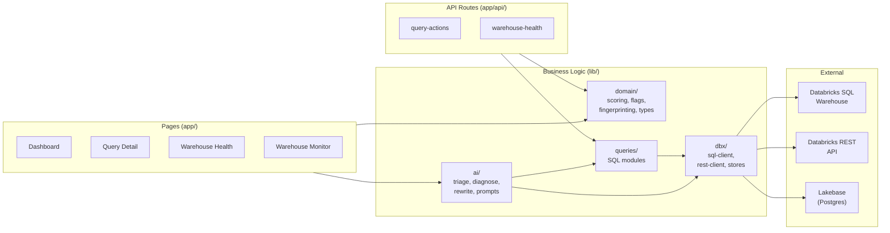
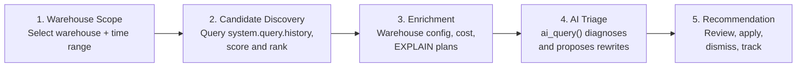

# Architecture

## Overview

Databricks SQL Co-Pilot is a Next.js application deployed to Databricks Apps. It helps platform administrators discover slow SQL queries, understand their impact, and use AI to propose optimized rewrites.



## Application Layers



## Data Flow

The core triage flow moves through five stages:



### Stage Details

| Stage | Data Source | Module |
|-------|-----------|--------|
| Warehouse Scope | `system.compute.warehouses` | `lib/queries/warehouses.ts` |
| Candidate Discovery | `system.query.history` | `lib/queries/query-history.ts`, `lib/domain/scoring.ts` |
| Enrichment | `system.billing.usage`, warehouse REST API | `lib/queries/warehouse-cost.ts`, `lib/dbx/rest-client.ts` |
| AI Triage | `ai_query()` via SQL warehouse | `lib/ai/aiClient.ts`, `lib/ai/triage.ts` |
| Recommendation | Lakebase (Postgres) | `lib/dbx/actions-store.ts`, `lib/dbx/rewrite-store.ts` |

## Authentication

Two auth modes, configured via `AUTH_MODE` env var:

| Mode | When | How |
|------|------|-----|
| **OBO** (on-behalf-of) | Default for Databricks Apps | User's identity forwarded; queries run as the logged-in user |
| **SP** (service principal) | Fallback / local dev | App's service principal credentials; PAT for local dev |

Credentials (`DATABRICKS_CLIENT_ID`, `DATABRICKS_CLIENT_SECRET`, `DATABRICKS_HOST`) are auto-injected by the Databricks Apps platform. See `lib/dbx/sql-client.ts` and `lib/dbx/obo.ts`.

## Persistence

Query actions, rewrite cache, triage cache, and health snapshots are stored in Lakebase (Databricks-managed Postgres). This is optional — the app works without it but loses cross-session state.

- **Auto-provisioned** at startup when `ENABLE_LAKEBASE=true`
- Prisma ORM with `@prisma/adapter-pg`
- Schema: `dbsql_copilot` (see `prisma/schema.prisma`)
- Module: `lib/dbx/prisma.ts`, `lib/lakebase/provision.ts`

## Directory Structure

```
.
├── app/                          # Next.js App Router
│   ├── api/                      # API route handlers
│   ├── components/dashboard/     # Dashboard-specific components
│   ├── queries/[fingerprint]/    # Query detail pages
│   ├── warehouse/[warehouseId]/  # Warehouse monitor
│   ├── warehouse-health/         # Warehouse health report
│   ├── dashboard.tsx             # Main dashboard component
│   └── page.tsx                  # Home page (server component, data loading)
├── components/ui/                # shadcn/ui primitives
├── lib/
│   ├── ai/                       # AI client, prompts, triage logic
│   │   └── prompts/              # Prompt templates and registry
│   ├── dbx/                      # Databricks clients and data stores
│   ├── domain/                   # Pure business logic (no I/O)
│   ├── queries/                  # SQL query modules
│   └── lakebase/                 # Lakebase provisioning
├── prisma/schema.prisma          # Database schema
├── scripts/                      # Deployment and startup scripts
└── docs/                         # Project documentation
```

## Key Design Decisions

| Decision | Rationale |
|----------|-----------|
| Next.js App Router | Server components for data loading; streaming for enrichment; deploys to Databricks Apps |
| `@databricks/sql` driver | Direct SQL warehouse access; supports OAuth and PAT auth modes |
| `ai_query()` via SQL | Uses the same warehouse connection; no separate model endpoint needed |
| Lakebase for persistence | Managed Postgres auto-provisioned by the app; zero infrastructure to manage |
| shadcn/ui | Accessible, themeable, composable components that can be customized per project |
| PII redaction by default | `normalizeSql()` masks literals before display/AI; security-first approach |
